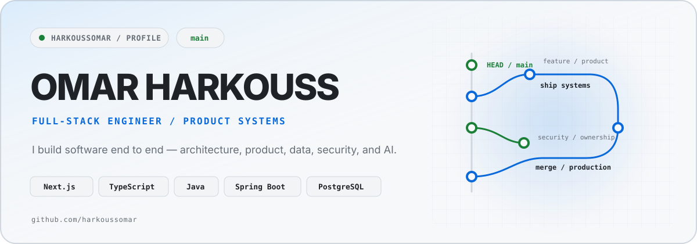

<picture>
  <source media="(prefers-color-scheme: dark)" srcset="./assets/hero-dark.svg">
  <source media="(prefers-color-scheme: light)" srcset="./assets/hero-light.svg">
  
</picture>

<div align="center">
  <a href="https://o-harkouss.vercel.app/">portfolio</a>
  &nbsp;·&nbsp;
  <a href="https://www.linkedin.com/in/omar-harkouss-2071b9304">linkedin</a>
  &nbsp;·&nbsp;
  <a href="mailto:harkouss.omar@gmail.com">email</a>
</div>

<br>

### `// main`

I build full-stack products end to end — from **data models, authorization rules, APIs, and background workflows** to **polished interfaces and AI-assisted features**.

Most of my recent work lives around multi-role products, secure business workflows, search, payments, and practical AI integration. I care about software that is **clear to reason about, difficult to misuse, and ready to operate in production**.

### `// working set`

```text
frontend   Next.js · React · TypeScript · Tailwind CSS · shadcn/ui · TanStack Query
backend    Java · Spring Boot · Node.js · tRPC · REST APIs
data       PostgreSQL · Prisma ORM · JPA/Hibernate · Flyway · pgvector
security   Spring Security · Better Auth · OAuth · JWT · RBAC · Zod
ai         OpenAI · Gemini · Vercel AI SDK
platform   Docker · Vercel · GitHub · pnpm · Maven · Cloudinary · Stripe
testing    Vitest · Playwright · Mockito · MockMvc · Testcontainers
```

### `// featured repository`

#### [`harkoussomar/zevlance`](https://github.com/harkoussomar/zevlance)

A secure, scalable API for a modern freelance marketplace, built around **Java 21, Spring Boot, PostgreSQL, Spring Security, and payment workflows**.

`Java 21` `Spring Boot` `PostgreSQL` `Spring Security` `Stripe` `Docker`

### `// how I like to build`

<table>
<tr>
<td width="25%"><b>Architecture</b><br><sub>clear boundaries & explicit domain rules</sub></td>
<td width="25%"><b>Reliability</b><br><sub>validation, transactions & tests</sub></td>
<td width="25%"><b>Security</b><br><sub>auth, ownership & least privilege</sub></td>
<td width="25%"><b>Product</b><br><sub>useful workflows over feature noise</sub></td>
</tr>
</table>

### `// elsewhere`

[`portfolio`](https://o-harkouss.vercel.app/) ·
[`linkedin`](https://www.linkedin.com/in/omar-harkouss-2071b9304) ·
[`email`](mailto:harkouss.omar@gmail.com)
